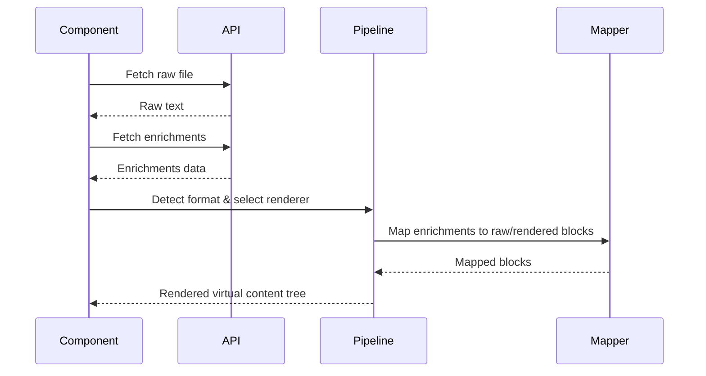

# Technical Design — Frontend


<!-- toc -->

- [1. Architecture Overview](#1-architecture-overview)
  - [1.1 Technology Stack](#11-technology-stack)
  - [1.2 Project Structure](#12-project-structure)
  - [1.3 Architectural Vision](#13-architectural-vision)
  - [1.4 Architecture Drivers](#14-architecture-drivers)
  - [1.5 Requirements Traceability Matrix](#15-requirements-traceability-matrix)
  - [1.6 Architecture Layers](#16-architecture-layers)
- [2. Principles & Constraints](#2-principles--constraints)
  - [2.1 Design Principles](#21-design-principles)
  - [2.2 Constraints](#22-constraints)
- [3. Technical Architecture](#3-technical-architecture)
  - [3.1 Domain Model](#31-domain-model)
  - [3.2 Component Model](#32-component-model)
  - [3.3 API Contracts](#33-api-contracts)
  - [3.4 Internal Dependencies](#34-internal-dependencies)
  - [3.5 External Dependencies](#35-external-dependencies)
  - [3.6 Interactions & Sequences](#36-interactions--sequences)
  - [3.7 Database schemas & tables](#37-database-schemas--tables)
- [4. Additional context](#4-additional-context)
  - [2. Routing System](#2-routing-system)
  - [3. State Management](#3-state-management)
  - [4. Left Menu Navigation (Sidebar)](#4-left-menu-navigation-sidebar)
  - [5. Virtual Content Rendering Pipeline](#5-virtual-content-rendering-pipeline)
  - [6. Enrichment System](#6-enrichment-system)
  - [7. API Layer](#7-api-layer)
  - [8. Authentication](#8-authentication)
  - [9. Theming System](#9-theming-system)
  - [10. Key Design Decisions](#10-key-design-decisions)
  - [11. Implementation Guidelines for Other Frameworks](#11-implementation-guidelines-for-other-frameworks)
  - [12. Performance Considerations](#12-performance-considerations)
  - [13. Testing Strategy](#13-testing-strategy)
  - [14. Accessibility](#14-accessibility)
  - [15. Browser Support](#15-browser-support)
  - [16. Use Case Realizations](#16-use-case-realizations)
  - [17. Component Specifications](#17-component-specifications)
  - [18. Error Handling Strategy](#18-error-handling-strategy)
  - [19. Performance Optimizations](#19-performance-optimizations)
- [5. Traceability](#5-traceability)

<!-- /toc -->

- [ ] `p3` - **ID**: `cpt-cyberwiki-design-frontend`
## 1. Architecture Overview

### 1.1 Technology Stack

**Core Framework:**
- React 18.3.1 with TypeScript 4.9.5
- Single-page application (SPA) architecture
- No server-side rendering

**Styling:**
- Tailwind CSS 3.4.18 (utility-first CSS framework)
- CSS custom properties for theming (`--bg-primary`, `--text-primary`, etc.)
- No CSS modules or styled-components

**Key Libraries:**
- `unified` + `remark-parse` + `remark-gfm` — Markdown AST parsing
- `react-markdown` — Markdown rendering fallback
- `lucide-react` — Icon library
- `@tanstack/react-virtual` — Virtual scrolling for large lists
- `rehype-expressive-code` — Syntax highlighting for code blocks
- `js-yaml` — YAML parsing

**Build Tools:**
- `react-scripts` 5.0.1 (Create React App)
- Node.js 25.1.0

### 1.2 Project Structure

```
src/frontend/
├── App.tsx                    # Root component, routing logic
├── index.tsx                  # Entry point
├── types.ts                   # Global TypeScript types and enums
├── constants.ts               # API URLs and constants
├── components/                # Shared UI components
│   ├── Layout.tsx            # Main layout with sidebar
│   ├── LoginPage.tsx         # Authentication page
│   ├── CommentsPanel.tsx     # Comment thread UI
│   ├── Sidebar/
│   │   ├── FileTree.tsx      # Developer mode tree
│   │   └── DocumentTree.tsx  # Document mode tree
│   └── Enrichments/
│       ├── EnrichedCodeView.tsx
│       ├── EnrichmentMarker.tsx
│       └── EnrichmentPanel.tsx
├── context/                   # React Context providers
│   ├── AuthContext.tsx       # User authentication state
│   ├── ThemeContext.tsx      # Light/dark theme
│   ├── RepositoryContext.tsx # Current repository state
│   └── UserSettingsContext.tsx
├── services/                  # API client modules
│   ├── apiClient.ts          # Base HTTP client
│   ├── authApi.ts
│   ├── repositoryApi.ts
│   ├── wikiApi.ts
│   ├── commentsApi.ts
│   ├── enrichmentProviderApi.ts
│   └── sourceProviderApi.ts
├── views/                     # Lazy-loaded page components
│   ├── Dashboard/
│   ├── Repositories/
│   │   ├── RepositoryDetail.tsx
│   │   └── components/
│   │       ├── FileViewer/
│   │       │   ├── FileViewer.tsx
│   │       │   ├── FileContent.tsx
│   │       │   ├── renderers/
│   │       │   │   ├── FormatRenderer.ts
│   │       │   │   ├── MarkdownFormatRenderer.tsx
│   │       │   │   ├── CodeFormatRenderer.tsx
│   │       │   │   ├── YAMLFormatRenderer.tsx
│   │       │   │   └── PlainTextRenderer.tsx
│   │       │   ├── enrichments/
│   │       │   │   └── types.ts
│   │       │   ├── components/
│   │       │   │   ├── MarkdownTreeView.tsx
│   │       │   │   └── YAMLTreeView.tsx
│   │       │   └── utils/
│   │       │       └── contentTypeDetector.ts
│   ├── Search/
│   ├── Profile/
│   └── ...
└── hooks/                     # Custom React hooks
```

### 1.3 Architectural Vision

The CyberWiki frontend is a React-based Single Page Application (SPA) that provides a format-agnostic, dual-mode reading and editing experience. It leverages hash-based routing to avoid server-side route configuration dependencies and uses a virtual content rendering pipeline to support non-destructive rich metadata layers (enrichments) over raw text.

The architecture prioritizes seamless context switching between developer-centric raw code views and PM/designer-centric structured documentation views, without requiring a heavy global state management solution.

### 1.4 Architecture Drivers

#### Functional Drivers

| Requirement | Design Response |
|-------------|------------------|
| `cpt-cyberwiki-fr-dual-navigation` | Mode Switching Mechanism per repository between Developer Mode (raw files) and Document Mode (clean hierarchy). |
| `cpt-cyberwiki-fr-format-agnostic-rendering` | Virtual Content Rendering Pipeline with distinct Format Renderers (PlainText, Markdown, YAML, Code). |
| `cpt-cyberwiki-fr-enrichments` | Dual Mapping System for overlaying metadata (PR diffs, comments) onto both raw lines and rendered blocks. |

#### NFR Allocation

| NFR ID | NFR Summary | Allocated To | Design Response | Verification Approach |
|--------|-------------|--------------|-----------------|----------------------|
| `cpt-cyberwiki-nfr-performance` | Fast initial load | Architecture | Lazy-loaded views via `React.lazy()`, Virtual scrolling with `@tanstack/react-virtual` | Bundle size analysis, Lighthouse |
| `cpt-cyberwiki-nfr-deployability` | Simple staging deployment | Routing | Hash-based SPA routing | Deployment testing |
| `cpt-cyberwiki-nfr-accessibility` | Accessible UI | UI Components | Keyboard navigation, ARIA labels, WCAG AA contrast | Accessibility audits |

### 1.5 Requirements Traceability Matrix

This section maps all PRD requirements to frontend design components and implementation status.

#### Navigation & Browsing Requirements

| Requirement ID | Priority | Requirement Summary | Design Component(s) | Status | Design Section |
|----------------|----------|---------------------|---------------------|--------|----------------|
| `cpt-cyberwiki-fr-browse-spaces` | p1 | Browse spaces and navigate to documents | `Dashboard`, `RepositoryList`, `Sidebar` | [ ] Not Started | Section 4.2 |
| `cpt-cyberwiki-fr-single-repo-entry` | p2 | Configurable single-repo entry page | `App.tsx` routing config, `RepositoryDetail` | [ ] Not Started | Section 4.2 |
| `cpt-cyberwiki-fr-left-nav-dual-mode` | p1 | Dual-mode navigation (Document/File Tree) | `Sidebar/FileTree.tsx`, `Sidebar/DocumentTree.tsx`, Mode switcher | [x] Designed | Section 4.4 |
| `cpt-cyberwiki-fr-document-index` | p1 | Configurable document index per space | `DocumentTree.tsx`, Backend API integration | [ ] Not Started | Section 4.4 |
| `cpt-cyberwiki-fr-title-extraction` | p1 | Title extraction rules (heading/frontmatter/filename) | `DocumentTree.tsx`, Backend title extraction API | [ ] Not Started | Section 4.4 |

#### Editing Requirements

| Requirement ID | Priority | Requirement Summary | Design Component(s) | Status | Design Section |
|----------------|----------|---------------------|---------------------|--------|----------------|
| `cpt-cyberwiki-fr-live-edit` | p1 | In-browser editing with live preview | `MarkdownEditor`, `LivePreview`, `EditorToolbar` | [ ] Not Started | TBD |
| `cpt-cyberwiki-fr-standard-formatting` | p1 | Standard formatting controls (bold, italic, lists, etc.) | `EditorToolbar`, `MarkdownFormatRenderer` | [ ] Not Started | TBD |
| `cpt-cyberwiki-fr-date-shortcut` | p1 | Date insertion via `//` shortcut | `MarkdownEditor` keyboard handler, `DatePicker` | [ ] Not Started | TBD |
| `cpt-cyberwiki-fr-date-badge-rendering` | p1 | Date badge rendering in all views | `DateBadge` component, `MarkdownFormatRenderer` | [ ] Not Started | TBD |
| `cpt-cyberwiki-fr-user-tag-search-shortcut` | p1 | User search/tagging via `@` shortcut | `MentionAutocomplete`, `MarkdownEditor` | [ ] Not Started | TBD |
| `cpt-cyberwiki-fr-mention-task-sync-discovery` | p3 | Scan synced Markdown for mentions/tasks | Backend sync service, Frontend refresh | [ ] Not Started | TBD |
| `cpt-cyberwiki-fr-mention-entity-badge-render` | p3 | Mention entity storage and badge rendering | `UserMentionBadge`, `MarkdownFormatRenderer` | [ ] Not Started | TBD |
| `cpt-cyberwiki-fr-mention-index` | p3 | Mention index view for tagged users | `MentionIndexView`, `mentionsApi` | [ ] Not Started | TBD |
| `cpt-cyberwiki-fr-task-extraction-checkbox` | p3 | Task extraction from checkbox lines | Backend task parser, `TaskList` component | [ ] Not Started | TBD |
| `cpt-cyberwiki-fr-task-dashboard` | p3 | Task dashboard with filters | `TaskDashboard`, `tasksApi` | [ ] Not Started | TBD |
| `cpt-cyberwiki-fr-smart-edit-highlight-new-text` | p1 | Highlight newly typed text | `MarkdownEditor` change tracking | [ ] Not Started | TBD |
| `cpt-cyberwiki-fr-smart-edit-ai-refine` | p2 | AI text refinement | `AIRefineButton`, `aiApi`, Preview modal | [ ] Not Started | TBD |

#### Comments Requirements

| Requirement ID | Priority | Requirement Summary | Design Component(s) | Status | Design Section |
|----------------|----------|---------------------|---------------------|--------|----------------|
| `cpt-cyberwiki-fr-inline-comments` | p1 | Inline commenting on documents | `CommentsPanel`, `CommentThread`, `InlineCommentMarker` | [x] Designed | Section 4.6 |
| `cpt-cyberwiki-fr-comment-persistence` | p1 | Comment persistence across content changes | `commentsApi`, Line anchoring service | [x] Designed | Section 4.6 |
| `cpt-cyberwiki-fr-comment-threads` | p2 | Threaded comment replies | `CommentThread`, `CommentReply` | [ ] Not Started | Section 4.6 |
| `cpt-cyberwiki-fr-comment-storage` | p1 | Database-native comment storage | Backend integration via `commentsApi` | [x] Designed | Section 4.6 |
| `cpt-cyberwiki-fr-comment-line-anchoring` | p1 | Line-level comment anchoring | `EnrichmentMarker`, Dual mapping system | [x] Designed | Section 4.6 |
| `cpt-cyberwiki-fr-mention-notification-preferences` | p3 | User notification preferences | `UserSettings`, `notificationApi` | [ ] Not Started | TBD |
| `cpt-cyberwiki-fr-admin-default-notification-channels` | p3 | Admin default notification channels | Admin settings panel, Backend config | [ ] Not Started | TBD |

#### Change Management Requirements

| Requirement ID | Priority | Requirement Summary | Design Component(s) | Status | Design Section |
|----------------|----------|---------------------|---------------------|--------|----------------|
| `cpt-cyberwiki-fr-inline-pending-changes` | p1 | Display inline pending changes | `PendingChangesOverlay`, `DiffView` | [ ] Not Started | TBD |
| `cpt-cyberwiki-fr-save-commit` | p1 | Save and commit workflow | `SaveButton`, `CommitDialog`, `wikiApi` | [ ] Not Started | TBD |
| `cpt-cyberwiki-fr-pending-changes` | p1 | Pending changes workflow (propose/review) | `PendingChangesList`, `ChangeReviewPanel` | [ ] Not Started | TBD |
| `cpt-cyberwiki-fr-change-approval` | p1 | Approve/reject pending changes | `ChangeApprovalButtons`, Backend workflow API | [ ] Not Started | TBD |
| `cpt-cyberwiki-fr-change-history` | p1 | Immutable change history | `ChangeHistoryView`, `changesApi` | [ ] Not Started | TBD |

#### Rich Previews Requirements

| Requirement ID | Priority | Requirement Summary | Design Component(s) | Status | Design Section |
|----------------|----------|---------------------|---------------------|--------|----------------|
| `cpt-cyberwiki-fr-markdown-preview` | p1 | Markdown preview rendering | `MarkdownFormatRenderer`, `react-markdown` | [x] Designed | Section 4.5 |
| `cpt-cyberwiki-fr-diagram-preview` | p1 | Sequence diagram rendering | `DiagramRenderer`, Mermaid integration | [ ] Not Started | Section 4.5 |
| `cpt-cyberwiki-fr-drawio-preview` | p2 | Draw.io diagram preview | `DrawioRenderer`, SVG embedding | [ ] Not Started | Section 4.5 |
| `cpt-cyberwiki-fr-table-rendering` | p1 | Table rendering | `MarkdownFormatRenderer`, GFM tables | [x] Designed | Section 4.5 |
| `cpt-cyberwiki-fr-custom-visuals` | p3 | Custom visual components | Plugin system, `CustomComponentRegistry` | [ ] Not Started | TBD |

#### Validation Requirements

| Requirement ID | Priority | Requirement Summary | Design Component(s) | Status | Design Section |
|----------------|----------|---------------------|---------------------|--------|----------------|
| `cpt-cyberwiki-fr-link-checker` | p1 | Link validation before save | `LinkValidator`, Pre-save validation hook | [ ] Not Started | TBD |
| `cpt-cyberwiki-fr-schema-validation` | p2 | Schema validation for structured docs | `SchemaValidator`, YAML/JSON schema support | [ ] Not Started | TBD |
| `cpt-cyberwiki-fr-custom-validators` | p2 | Custom validator plugins | `ValidatorRegistry`, Plugin API | [ ] Not Started | TBD |

#### Search Requirements

| Requirement ID | Priority | Requirement Summary | Design Component(s) | Status | Design Section |
|----------------|----------|---------------------|---------------------|--------|----------------|
| `cpt-cyberwiki-fr-fulltext-search` | p2 | Full-text search across documents | `SearchBar`, `SearchResults`, `searchApi` | [ ] Not Started | TBD |
| `cpt-cyberwiki-fr-semantic-search` | p2 | AI-powered semantic search | `SemanticSearchToggle`, Backend embeddings API | [ ] Not Started | TBD |

#### JIRA Integration Requirements

| Requirement ID | Priority | Requirement Summary | Design Component(s) | Status | Design Section |
|----------------|----------|---------------------|---------------------|--------|----------------|
| `cpt-cyberwiki-fr-jira-badge` | p1 | Inline JIRA status badges | `JiraBadge`, `jiraApi`, `MarkdownFormatRenderer` | [ ] Not Started | TBD |
| `cpt-cyberwiki-fr-jira-views` | p2 | JIRA views (grid, chart, Gantt) | `JiraGridView`, `JiraChartView`, `JiraGanttView` | [ ] Not Started | TBD |
| `cpt-cyberwiki-fr-jira-search` | p2 | JIRA issue search within app | `JiraSearchPanel`, `jiraApi` | [ ] Not Started | TBD |

#### Authentication Requirements

| Requirement ID | Priority | Requirement Summary | Design Component(s) | Status | Design Section |
|----------------|----------|---------------------|---------------------|--------|----------------|
| `cpt-cyberwiki-fr-authentication` | p1 | User authentication | `LoginPage`, `AuthContext`, `authApi` | [x] Designed | Section 4.8 |
| `cpt-cyberwiki-fr-vcs-authentication` | p1 | VCS provider authentication | `GitCredentialsForm`, `gitProviderApi` | [ ] Not Started | Section 4.8 |

#### VCS Integration Requirements

| Requirement ID | Priority | Requirement Summary | Design Component(s) | Status | Design Section |
|----------------|----------|---------------------|---------------------|--------|----------------|
| `cpt-cyberwiki-fr-vcs-backend` | p1 | Pluggable VCS backend (GitHub/Bitbucket) | Backend abstraction, Frontend provider selector | [x] Designed | Section 4.7 |
| `cpt-cyberwiki-fr-vcs-interface` | p1 | Abstract VCS provider interface | Backend API contracts, Frontend API client | [x] Designed | Section 4.7 |
| `cpt-cyberwiki-fr-repo-listing` | p1 | Repository listing | `RepositoryList`, `repositoryApi` | [ ] Not Started | Section 4.2 |
| `cpt-cyberwiki-fr-file-tree-navigation` | p1 | File tree navigation | `Sidebar/FileTree.tsx`, Tree state management | [x] Designed | Section 4.4 |
| `cpt-cyberwiki-fr-file-content-display` | p1 | File content display | `FileViewer`, Format renderers | [x] Designed | Section 4.5 |
| `cpt-cyberwiki-fr-pr-listing` | p1 | Pull request listing | `PRList`, `sourceProviderApi` | [ ] Not Started | TBD |
| `cpt-cyberwiki-fr-pr-diff-review` | p3 | PR diff review UI | `PRDiffView`, Enrichment integration | [x] Designed | Section 4.6 |
| `cpt-cyberwiki-fr-git-blame` | p2 | Git blame integration | `BlameView`, Backend git blame API | [ ] Not Started | TBD |
| `cpt-cyberwiki-fr-api-token-management` | p2 | API token management UI | `TokenManagementPanel`, `authApi` | [ ] Not Started | TBD |

#### Non-Functional Requirements

| Requirement ID | Priority | Requirement Summary | Design Component(s) | Status | Design Section |
|----------------|----------|---------------------|---------------------|--------|----------------|
| `cpt-cyberwiki-nfr-search-latency` | p1 | Search results < 2s | Search API optimization, Result caching | [ ] Not Started | Section 4.12 |
| `cpt-cyberwiki-nfr-save-latency` | p1 | Save/commit < 60s | Optimistic UI updates, Background sync | [ ] Not Started | Section 4.12 |
| `cpt-cyberwiki-nfr-repo-list-performance` | p2 | Fast repository list loading | Virtual scrolling, Pagination | [ ] Not Started | Section 4.12 |
| `cpt-cyberwiki-nfr-ux` | p2 | Responsive UI | Tailwind responsive utilities, Mobile-first | [x] Designed | Section 4.12 |
| `cpt-cyberwiki-nfr-credential-security` | p1 | Secure credential storage | Backend encryption, No client-side storage | [x] Designed | Section 4.8 |

#### Use Cases

| Use Case ID | Priority | Use Case Summary | Involved Components | Status | Design Section |
|-------------|----------|------------------|---------------------|--------|----------------|
| `cpt-cyberwiki-usecase-edit-commit` | p1 | Edit and commit a document | `MarkdownEditor`, `SaveButton`, `CommitDialog`, `wikiApi` | [ ] Not Started | TBD |
| `cpt-cyberwiki-usecase-auth-configure` | p1 | Authenticate and configure Git credentials | `LoginPage`, `GitCredentialsForm`, `authApi` | [ ] Not Started | TBD |
| `cpt-cyberwiki-usecase-browse-repo` | p1 | Browse repository file tree | `Sidebar/FileTree`, `RepositoryDetail`, `FileViewer` | [x] Designed | Section 4.4 |
| `cpt-cyberwiki-usecase-view-file-comments` | p1 | View file content with inline comments | `FileViewer`, `CommentsPanel`, `EnrichmentMarker` | [x] Designed | Section 4.6 |
| `cpt-cyberwiki-usecase-view-pr` | p1 | View PRs and navigate to VCS provider | `PRList`, `PRDetail`, External link handler | [ ] Not Started | TBD |

**Traceability Summary:**
- Total Requirements: 68
- Designed: 16 (23.5%)
- Not Started: 52 (76.5%)
- Priority 1 (p1): 37 total, 11 designed (29.7%)
- Priority 2 (p2): 15 total, 0 designed (0%)
- Priority 3 (p3): 11 total, 0 designed (0%)
- Use Cases: 5 total, 2 designed (40%)

### 1.6 Architecture Layers

| Layer | Responsibility | Technology |
|-------|---------------|------------|
| Presentation | User interface, view rendering, lazy loading | React 18, Tailwind CSS |
| State | Auth session, theme, local view state | React Context, Custom Hooks |
| Rendering Pipeline | Content parsing, enrichment mapping | `unified`, `remark`, Format Renderers |
| API Integration | HTTP calls, auth attachment | `apiClient`, Resource modules |

## 2. Principles & Constraints

### 2.1 Design Principles

#### Non-Destructive Rendering

- [ ] `p2` - **ID**: `cpt-cyberwiki-principle-non-destructive`

The original file content is never modified directly by the UI layer. Instead, ephemeral "virtual content" is generated and rendered, allowing multiple enrichments (diffs, comments) to coexist without conflict.

#### Lean State Management

- [ ] `p2` - **ID**: `cpt-cyberwiki-principle-lean-state`

Avoid global state libraries (like Redux or Zustand) in favor of React Context for low-frequency updates and custom hooks/local state for view-level data. Data volumes do not justify a global store in v1.

### 2.2 Constraints

#### Routing Mechanism

- [ ] `p2` - **ID**: `cpt-cyberwiki-constraint-hash-routing`

Must use hash-based routing (`Urls` enum) to avoid server-side catch-all configuration requirements.

#### Browser Support

- [ ] `p2` - **ID**: `cpt-cyberwiki-constraint-browser-support`

Modern browsers only (Chrome 90+, Firefox 88+, Safari 14+, Edge 90+). No polyfills required.

## 3. Technical Architecture

### 3.1 Domain Model

**Technology**: TypeScript Interfaces/Types (`src/frontend/types.ts`)

**Core Entities**:

| Entity | Description | Schema |
|--------|-------------|--------|
| VirtualContent | Merged state of raw file + diff enrichments | `types.ts` |
| Enrichment | Metadata layer (comment, diff, annotation) | `types.ts` |
| Repository | Git repository context | `types.ts` |
| TreeNode | Tree data structure for sidebar navigation | `types.ts` |

### 3.2 Component Model

#### Virtual Content Pipeline

- [ ] `p2` - **ID**: `cpt-cyberwiki-component-rendering-pipeline`

##### Why this component exists

Enables rendering of diverse file formats while applying rich interactive overlays without modifying the source text.

##### Responsibility scope

Content type detection (`contentTypeDetector.ts`), renderer selection (`FormatRendererRegistry`), AST parsing (`unified`/`js-yaml`), enrichment mapping (raw vs rendered), and visual rendering (`MarkdownTreeView`, `YAMLTreeView`, etc.).

##### Responsibility boundaries

Does not handle data fetching or persistence.

##### Related components (by ID)

- `cpt-cyberwiki-component-api-client` — depends on for fetching raw content and enrichments.

#### API Layer

- [ ] `p2` - **ID**: `cpt-cyberwiki-component-api-client`

##### Why this component exists

Centralizes all HTTP communication and handles authentication transparently.

##### Responsibility scope

Attaching session cookies (`credentials: 'include'`), CSRF token handling, error throwing on non-2xx, and exposing resource-specific modules (`wikiApi`, `enrichmentsApi`, `repositoryApi`, `authApi`).

##### Responsibility boundaries

Does not manage UI state or rendering.

#### Left Menu Navigation (Sidebar)

- [ ] `p2` - **ID**: `cpt-cyberwiki-component-sidebar-nav`

##### Why this component exists

Provides contextual, persona-driven navigation through repository contents.

##### Responsibility scope

Managing dual navigation modes (Developer Mode via `FileTree.tsx`, Document Mode via `DocumentTree.tsx`), handling favorites/recent repositories, and interacting with the `wikiApi` for tree data.

##### Responsibility boundaries

Does not handle file content rendering.

### 3.3 API Contracts

- **Contracts**: `cpt-cyberwiki-contract-frontend-api`
- **Technology**: REST

**Endpoints Overview**:

| Method | Path | Description | Stability |
|--------|------|-------------|-----------|
| `GET` | `/api/v1/*` | Handled via `services/apiClient.ts` wrapper modules | stable |

### 3.4 Internal Dependencies

| Dependency Module | Interface Used | Purpose |
|-------------------|----------------|----------|
| Custom Hooks | `useRepositories`, `useFileContent`, `useEnrichments` | Encapsulate fetch + loading + error states |
| React Context | `AuthContext`, `ThemeContext`, `RepositoryContext`, `UserSettingsContext` | Provide session, theme, repo state, user settings |

### 3.5 External Dependencies

| Dependency Module | Interface Used | Purpose |
|-------------------|---------------|---------|
| Backend Server | REST API | Data persistence, tree building, and authentication (Django session) |

### 3.6 Interactions & Sequences

#### Enrichment Rendering Flow

**ID**: `cpt-cyberwiki-seq-enrichment-rendering`



### 3.7 Database schemas & tables

N/A - Frontend does not define database schemas.

## 4. Additional context

### 2. Routing System

#### 2.1 Hash-Based Routing

**Implementation:** Client-side hash-based routing (no HTML5 History API).

**Rationale:** Avoids server-side catch-all configuration in staging environments. All routes handled by `index.html`.

**Route Format:**
```
#<view>?<query-params>
```

**Route Definitions** (from `types.ts`):
```typescript
enum Urls {
  Dashboard = 'dashboard',
  Repositories = 'repositories',
  Spaces = 'spaces',
  DocumentEditor = 'doc',
  Search = 'search',
  ChangeHistory = 'history',
  PendingChanges = 'pending',
  JiraIntegration = 'jira',
  UserManagement = 'user-management',
  Profile = 'profile',
}
```

**Route Examples:**
- `#repositories` — Repository list
- `#repositories?repo=123&path=docs/README.md` — File viewer
- `#search?q=authentication` — Search results
- `#profile` — User profile

#### 2.2 Navigation Implementation

**Hash Change Listener:**
```typescript
useEffect(() => {
  const onHashChange = () => {
    const hash = window.location.hash.slice(1);
    const [pageName] = hash.split('?');
    setActiveView(pageName || Urls.Dashboard);
  };
  window.addEventListener('hashchange', onHashChange);
  return () => window.removeEventListener('hashchange', onHashChange);
}, []);
```

**Navigation Function:**
```typescript
const navigate = (view: string) => {
  window.location.hash = view;
};
```

#### 2.3 Lazy Loading

All views are lazy-loaded using `React.lazy()` to minimize initial bundle size:

```typescript
const Dashboard = React.lazy(() => import('./views/Dashboard'));
const Repositories = React.lazy(() => import('./views/Repositories'));
// ... etc
```

Wrapped in `React.Suspense` with a loading fallback:
```typescript
<React.Suspense fallback={<ViewLoadingFallback />}>
  {activeView === Urls.Dashboard && <Dashboard />}
  {activeView === Urls.Repositories && <Repositories />}
  {/* ... */}
</React.Suspense>
```

---

### 3. State Management

#### 3.1 Architecture

**No global state library** (Redux, Zustand, MobX). State management uses:

1. **React Context** — Low-frequency, app-wide state
2. **Local Component State** — View-specific data
3. **URL Parameters** — Navigation state (current repo, file path)

#### 3.2 React Contexts

**AuthContext** (`context/AuthContext.tsx`):
```typescript
interface AuthState {
  isAuthenticated: boolean;
  user: User | null;
  isLoading: boolean;
}

interface AuthContextType extends AuthState {
  login: (username: string, password: string) => Promise<void>;
  logout: () => Promise<void>;
  refreshUser: () => Promise<void>;
}
```

**ThemeContext** (`context/ThemeContext.tsx`):
```typescript
interface ThemeContextType {
  theme: 'light' | 'dark';
  toggleTheme: () => void;
}
```

**UserSettingsContext** (`context/UserSettingsContext.tsx`):
```typescript
interface UserSettings {
  theme: Theme;
  defaultSpaceId?: number;
}
```

**RepositoryContext** (`context/RepositoryContext.tsx`):
```typescript
interface RepositoryContextType {
  currentRepository: Repository | null;
  setCurrentRepository: (repo: Repository | null) => void;
}
```

#### 3.3 Local State Pattern

Views fetch and manage their own data:

```typescript
function RepositoryDetail() {
  const [repository, setRepository] = useState<Repository | null>(null);
  const [fileContent, setFileContent] = useState<string>('');
  const [loading, setLoading] = useState(true);
  const [error, setError] = useState<string | null>(null);

  useEffect(() => {
    const fetchData = async () => {
      try {
        setLoading(true);
        const repo = await repositoryApi.getById(repoId);
        setRepository(repo);
      } catch (err) {
        setError(err.message);
      } finally {
        setLoading(false);
      }
    };
    fetchData();
  }, [repoId]);
}
```

---

### 4. Left Menu Navigation (Sidebar)

#### 4.1 Dual Navigation Modes

The sidebar provides **two distinct navigation modes** per repository, addressing different user personas:

**Developer Mode (GitHub-like):**
- Shows complete raw file structure
- All files visible (code, config, hidden files)
- Technical file icons based on extensions
- Filenames displayed as-is

**Document Mode (Confluence-like):**
- Shows only documentation files (`.md`, `.mdx`)
- Hides technical files (`.ts`, `.json`, `.py`, etc.)
- Human-readable titles extracted from file content
- Generic "page" icons instead of file extension icons
- "Folder-as-Page" behavior (folders with `README.md` act as clickable pages)

#### 4.2 Mode Switching Implementation

**UI Location:** Dropdown next to repository name in sidebar

**Persistence:** User's preferred mode stored in backend per repository

**API Calls:**
```typescript
// Get current mode
const mode = await repositoryApi.getViewMode(repositoryId);

// Set mode
await repositoryApi.setViewMode(repositoryId, 'developer' | 'document');
```

**State Management:**
```typescript
const [viewMode, setViewMode] = useState<'developer' | 'document'>('developer');

useEffect(() => {
  if (repoId) {
    const mode = await repositoryApi.getViewMode(repoId);
    setViewMode(mode);
  }
}, [repoId]);
```

#### 4.3 FileTree Component (Developer Mode)

**Location:** `components/Sidebar/FileTree.tsx`

**Features:**
- Recursive tree structure
- Lazy loading of folder contents on expand
- Auto-expansion to show current file
- Click folder → navigate to folder view
- Click file → navigate to file viewer

**Tree Data Structure:**
```typescript
interface TreeNode {
  name: string;
  path: string;
  type: 'file' | 'dir';
  children?: TreeNode[];
  title?: string; // Only in document mode
}
```

**API Endpoint:**
```
GET /api/wiki/repositories/{id}/tree?mode=developer&branch={branch}&path={path}
```

**Implementation Pattern:**
```typescript
function TreeNodeItem({ node, level, expandedPaths, onToggleExpand }) {
  const [children, setChildren] = useState<TreeNode[]>(node.children || []);
  const [loading, setLoading] = useState(false);

  const handleClick = async () => {
    if (node.type === 'dir') {
      if (!isExpanded && children.length === 0) {
        setLoading(true);
        const response = await wikiApi.getRepositoryTree(
          repositoryId, 'developer', branch, node.path
        );
        setChildren(response.tree);
        setLoading(false);
      }
      onToggleExpand(node.path, !isExpanded);
    } else {
      navigate(`#repositories?repo=${repositoryId}&path=${node.path}`);
    }
  };

  return (
    <div>
      <button onClick={handleClick} style={{ paddingLeft: `${level * 12}px` }}>
        {node.type === 'dir' ? <Folder /> : <FileCode />}
        <span>{node.name}</span>
      </button>
      {isExpanded && children.map(child => 
        <TreeNodeItem node={child} level={level + 1} />
      )}
    </div>
  );
}
```

#### 4.4 DocumentTree Component (Document Mode)

**Location:** `components/Sidebar/DocumentTree.tsx`

**Differences from FileTree:**
- Displays `node.title` instead of `node.name`
- Uses generic `FileText` icon for all documents
- Filters out non-document files (done server-side)

**Title Extraction (Backend):**
1. Parse first `# H1` heading from Markdown
2. Fallback: Format filename (`api_guide.md` → "Api Guide")

**API Endpoint:**
```
GET /api/wiki/repositories/{id}/tree?mode=document&branch={branch}&path={path}
```

#### 4.5 Favorites and Recent Repositories

**UI:** Collapsible accordion sections at top of sidebar

**Auto-collapse:** When a repository is selected, the favorites/recent list collapses to save space

**Data Sources:**
```typescript
// Favorites (user-starred repos)
const favorites = await repositoryApi.getFavorites();

// Recent (last 5 accessed repos)
const recent = await repositoryApi.getRecent();
```

**Toggle Implementation:**
```typescript
const [repoListExpanded, setRepoListExpanded] = useState(true);

useEffect(() => {
  if (currentRepoId) {
    setRepoListExpanded(false); // Auto-collapse when repo selected
  }
}, [currentRepoId]);
```

---

### 5. Virtual Content Rendering Pipeline

#### 5.1 Overview

The **Virtual Content Rendering Pipeline** is a format-agnostic framework for rendering file content with independent metadata layers (enrichments). The original file content is **never modified directly**; instead, an ephemeral "virtual content" is generated and rendered.

**Key Principle:** Separation of content from metadata. Enrichments (comments, diffs, annotations) are overlaid on content without mutating the source.

#### 5.2 Pipeline Phases

**Phase 1: Content Type Detection**

**Location:** `views/Repositories/components/FileViewer/utils/contentTypeDetector.ts`

**Algorithm:**
1. Check file extension against known mappings
2. If unknown, analyze content heuristically (patterns, shebangs)
3. Return `ContentTypeInfo`

**Content Types:**
```typescript
type ContentType = 'markdown' | 'code' | 'plaintext';

interface ContentTypeInfo {
  type: ContentType;
  language?: string; // For code: 'javascript', 'python', etc.
  extension?: string;
}
```

**Extension Mappings:**
- Markdown: `.md`, `.markdown`, `.mdown`, `.mkd`
- Code: `.js`, `.ts`, `.py`, `.java`, `.cpp`, `.go`, `.rs`, etc. (40+ languages)
- YAML: `.yaml`, `.yml`
- Plaintext: `.txt`, `.text`

**Heuristic Detection:**
```typescript
// Markdown patterns
const markdownPatterns = [
  /^#{1,6}\s+/m,        // Headings
  /^\*\s+/m,            // Unordered lists
  /^\d+\.\s+/m,         // Ordered lists
  /^\[.+\]\(.+\)/m,     // Links
  /^```/m,              // Code blocks
];

// Code patterns
const codePatterns = [
  /^#!\//, // Shebang
  /^import\s+/m,
  /^from\s+.+\s+import/m,
  /^package\s+/m,
];
```

**Phase 2: Renderer Selection**

**Location:** `views/Repositories/components/FileViewer/renderers/FormatRenderer.ts`

**Registry Pattern:**
```typescript
class FormatRendererRegistry {
  private renderers: Map<string, FormatRenderer> = new Map();

  register(renderer: FormatRenderer): void {
    this.renderers.set(renderer.name, renderer);
  }

  getRenderer(contentType: ContentTypeInfo): FormatRenderer | null {
    for (const renderer of this.renderers.values()) {
      if (renderer.canHandle(contentType)) {
        return renderer;
      }
    }
    return null;
  }
}
```

**Registered Renderers:**
```typescript
formatRendererRegistry.register(new MarkdownFormatRenderer());
formatRendererRegistry.register(new CodeFormatRenderer());
formatRendererRegistry.register(new YAMLFormatRenderer());
formatRendererRegistry.register(new PlainTextRenderer());
```

**Phase 3: Parsing**

**Interface:**
```typescript
interface FormatRenderer {
  name: string;
  supportedTypes: ContentTypeInfo['type'][];
  supportedEnrichments: Enrichment['type'][];
  
  parse(content: string, contentType: ContentTypeInfo, prDiffData?: any): ParseResult;
  render(parseResult: ParseResult, enrichments: Enrichment[], options: RenderOptions): ReactNode;
  canHandle(contentType: ContentTypeInfo): boolean;
}

interface ParseResult {
  ast: any;                  // Format-specific AST
  blocks: BlockMap[];        // Block ID to line mapping
  metadata?: Record<string, any>;
}

interface BlockMap {
  blockId: string;
  rawLines: number[];        // Which raw lines this block represents
  renderedLines?: number[];  // Which rendered lines (if applicable)
  type: string;              // 'markdown_heading', 'code_line', etc.
  metadata?: Record<string, any>;
}
```

**Phase 4: Ephemeral Content Generation**

For files with PR diffs, the renderer builds **ephemeral content** by inserting deleted lines:

```typescript
// Original file (current state)
Line 1: import React from 'react';
Line 2: function App() {
Line 3:   return <div>Hello</div>;
Line 4: }

// PR Diff (hunks)
- Line 2: function MyApp() {
+ Line 2: function App() {

// Ephemeral content (for rendering)
Line 1: import React from 'react';
Line 2: function MyApp() {        // DELETED (shown with strikethrough)
Line 3: function App() {           // ADDED (shown with green background)
Line 4:   return <div>Hello</div>;
Line 5: }
```

**Implementation:**
```typescript
let ephemeralContent = content;
const lineChangeTypes = new Map<number, 'add' | 'delete' | 'context'>();

if (prDiffData && prDiffData.hunks) {
  const currentLines = content.split('\n');
  const ephemeralLines: string[] = [];
  
  prDiffData.hunks.forEach(hunk => {
    hunk.lines.forEach(line => {
      if (line.type === 'delete') {
        ephemeralLines.push(line.content);
        lineChangeTypes.set(ephemeralLineNumber, 'delete');
      } else if (line.type === 'add') {
        ephemeralLines.push(line.content);
        lineChangeTypes.set(ephemeralLineNumber, 'add');
      } else {
        ephemeralLines.push(line.content);
        lineChangeTypes.set(ephemeralLineNumber, 'context');
      }
    });
  });
  
  ephemeralContent = ephemeralLines.join('\n');
}
```

**Phase 5: AST Parsing**

Each renderer parses content into an Abstract Syntax Tree:

**Markdown (using `unified` + `remark`):**
```typescript
const processor = unified().use(remarkParse).use(remarkGfm);
const ast = processor.parse(ephemeralContent) as Root;
```

**YAML (using `js-yaml`):**
```typescript
const ast = yaml.load(content);
```

**Code (line-based):**
```typescript
const lines = content.split('\n');
const ast = { type: 'code', lines };
```

**Phase 6: Block Map Generation**

Map raw file lines to rendered blocks:

```typescript
// Markdown: Each line is a block
const blocks: BlockMap[] = lines.map((_, index) => ({
  blockId: `markdown-line-${index + 1}`,
  rawLines: [index + 1],
  type: 'markdown_line',
  metadata: {},
}));

// YAML: Each key-value pair is a block
const blocks: BlockMap[] = yamlNodes.map((node, index) => ({
  blockId: `yaml-node-${index}`,
  rawLines: [node.startLine, node.endLine],
  type: 'yaml_mapping',
  metadata: { key: node.key },
}));
```

**Phase 7: Enrichment Mapping**

Convert enrichments to dual mappings (raw lines + rendered blocks):

```typescript
interface Enrichment {
  id: string;
  type: 'comment' | 'diff' | 'annotation' | 'highlight';
  
  // Dual mapping
  rawMapping: RawMapping;
  renderedMapping: RenderedMapping;
  
  // Visual representation
  visual: EnrichmentVisual;
  
  // Data
  data: any;
  createdAt: string;
  createdBy: string;
}

interface RawMapping {
  startLine: number;
  endLine: number;
  startColumn?: number;
  endColumn?: number;
}

interface RenderedMapping {
  blockIds: string[];
  positions?: Array<{
    blockId: string;
    offset?: number;
    lineOffset?: number;
  }>;
}

interface EnrichmentVisual {
  markerType: 'gutter' | 'inline' | 'overlay' | 'highlight' | 'badge';
  color: 'blue' | 'green' | 'red' | 'yellow' | 'orange' | 'purple';
  icon?: string;
  label?: string;
  tooltip?: string;
  priority: number;
}
```

**Phase 8: Rendering**

Render AST with enrichments applied:

```typescript
render(parseResult: ParseResult, enrichments: Enrichment[], options: RenderOptions): ReactNode {
  return (
    <MarkdownTreeView
      nodes={parseResult.ast.nodes}
      fileComments={enrichments.filter(e => e.type === 'comment')}
      diffLines={new Set(enrichments.filter(e => e.type === 'diff').map(e => e.rawMapping.startLine))}
      onLineClick={options.onLineClick}
    />
  );
}
```

#### 5.3 Format Renderers

**MarkdownFormatRenderer** (`renderers/MarkdownFormatRenderer.tsx`):

**AST Conversion:**
```typescript
// Convert MDAST (remark AST) to UnifiedNode format
interface UnifiedNode {
  type: string;
  position: {
    start: { line: number; column: number; offset: number };
    end: { line: number; column: number; offset: number };
  };
  value: string;
  data?: {
    nodeType: string;
    changeType?: 'added' | 'deleted' | 'modified';
    depth?: number;      // For headings
    ordered?: boolean;   // For lists
  };
  children?: UnifiedNode[];
}
```

**Rendering:** `MarkdownTreeView` component renders nodes as collapsible blocks with enrichment badges

**CodeFormatRenderer** (`renderers/CodeFormatRenderer.tsx`):

**Syntax Highlighting:** Uses `rehype-expressive-code` for syntax highlighting

**Line-based Rendering:** Each line is a separate block with line numbers

**YAMLFormatRenderer** (`renderers/YAMLFormatRenderer.tsx`):

**AST Parsing:** Uses `js-yaml` to parse YAML into object tree

**Rendering:** `YAMLTreeView` component renders as collapsible key-value tree

**PlainTextRenderer** (`renderers/PlainTextRenderer.tsx`):

**Fallback:** Simple `<pre>` tag with line wrapping

#### 5.4 MarkdownTreeView Component

**Location:** `views/Repositories/components/FileViewer/components/MarkdownTreeView.tsx`

**Features:**
- Groups consecutive nodes with same `changeType` into visual blocks
- Applies background colors based on change type:
  - Green (`#e6ffed`) for added
  - Red (`#ffeef0`) for deleted
  - Yellow (`#fffbdd`) for modified
  - Orange (`#fff4e5`) for comments
- Shows badges for:
  - PR number (clickable link to PR)
  - Comment count (clickable to open comment panel)
  - Line numbers
- Strikethrough text for deleted content

**Block Grouping Algorithm:**
```typescript
const groupedBlocks: UnifiedNode[][] = [];
let currentBlock: UnifiedNode[] = [];
let currentChangeType: string | undefined = undefined;

nodes.forEach(node => {
  const nodeChangeType = node.data?.changeType;
  
  if (nodeChangeType !== currentChangeType || !nodeChangeType) {
    if (currentBlock.length > 0) {
      groupedBlocks.push(currentBlock);
    }
    currentBlock = [node];
    currentChangeType = nodeChangeType;
  } else {
    currentBlock.push(node);
  }
});
```

**Visual Styling:**
```typescript
let backgroundColor = 'transparent';
let borderLeft = 'none';

if (blockComments.length > 0) {
  backgroundColor = '#fff4e5';
  borderLeft = '3px solid #ff9800';
} else if (changeType === 'added') {
  backgroundColor = '#e6ffed';
  borderLeft = '3px solid #28a745';
} else if (changeType === 'deleted') {
  backgroundColor = '#ffeef0';
  borderLeft = '3px solid #d73a49';
} else if (changeType === 'modified') {
  backgroundColor = '#fffbdd';
  borderLeft = '3px solid #ffc107';
}
```

---

### 6. Enrichment System

#### 6.1 Enrichment Types

**Comment Enrichment:**
```typescript
interface CommentEnrichment {
  type: 'comment';
  rawMapping: { startLine: number; endLine: number };
  data: {
    text: string;
    resolved: boolean;
    replyCount: number;
    replies?: Array<{
      id: string;
      text: string;
      author: string;
      createdAt: string;
    }>;
  };
  visual: {
    markerType: 'badge';
    color: 'orange';
    icon: 'MessageSquare';
    priority: 10;
  };
}
```

**Diff Enrichment (PR Changes):**
```typescript
interface DiffEnrichment {
  type: 'diff';
  rawMapping: { startLine: number; endLine: number };
  data: {
    changeType: 'added' | 'deleted' | 'modified';
    prNumber?: number;
    prTitle?: string;
    prAuthor?: string;
  };
  visual: {
    markerType: 'highlight';
    color: 'green' | 'red' | 'yellow';
    priority: 5;
  };
}
```

**Annotation Enrichment:**
```typescript
interface AnnotationEnrichment {
  type: 'annotation';
  data: {
    title: string;
    message: string;
    severity: 'info' | 'warning' | 'error';
  };
  visual: {
    markerType: 'gutter';
    color: 'blue' | 'yellow' | 'red';
    icon: 'Info' | 'AlertTriangle' | 'XCircle';
  };
}
```

#### 6.2 Dual Mapping System

**Problem:** Different formats render content differently. A line in raw Markdown may map to multiple rendered blocks.

**Solution:** Enrichments store both raw line positions and rendered block IDs.

**Example:**
```markdown
# Heading 1
This is a paragraph.
```

**Raw Mapping:**
- Line 1: `# Heading 1`
- Line 2: `This is a paragraph.`

**Rendered Mapping:**
- Block 1: `<h1>Heading 1</h1>`
- Block 2: `<p>This is a paragraph.</p>`

**Enrichment on Line 1:**
```typescript
{
  rawMapping: { startLine: 1, endLine: 1 },
  renderedMapping: { blockIds: ['markdown-heading-1'] }
}
```

#### 6.3 Visual Representations

**Marker Types:**
- `gutter` — Icon in left gutter (line numbers area)
- `inline` — Inline badge within text
- `overlay` — Floating overlay on hover
- `highlight` — Background color
- `badge` — Badge at end of line/block

**Color Coding:**
- `green` — Added content (PR diffs)
- `red` — Deleted content (PR diffs)
- `yellow` — Modified content (PR diffs)
- `orange` — Comments
- `blue` — Info annotations
- `purple` — Highlights (search results)

#### 6.4 Interactive Collaboration

**Comment Badge Click:**
```typescript
const handleCommentClick = (lineNumber: number) => {
  // Open comments panel
  setShowCommentsPanel(true);
  setSelectedLine(lineNumber);
  
  // Scroll to comments for this line
  const comments = fileComments.filter(c => 
    c.computed_line_number === lineNumber
  );
  setActiveComments(comments);
};
```

**PR Badge Click:**
```typescript
<a
  href={`https://git.example.com/pull-requests/${prNumber}`}
  target="_blank"
  onClick={e => e.stopPropagation()}
>
  <GitPullRequest size={12} />#{prNumber}
</a>
```

**Line Click (Add Comment):**
```typescript
const onLineClick = (lineNumber: number) => {
  setCommentDraft({
    lineStart: lineNumber,
    lineEnd: lineNumber,
    content: '',
  });
  setShowCommentForm(true);
};
```

---

### 7. API Layer

#### 7.1 Base API Client

**Location:** `services/apiClient.ts`

**Features:**
- CSRF token handling (Django)
- Session cookie authentication
- Automatic JSON parsing
- Error handling

**Implementation:**
```typescript
function getCsrfToken(): string {
  const match = document.cookie.match(/csrftoken=([^;]+)/);
  return match ? match[1] : '';
}

async function request<T>(path: string, options: RequestInit = {}): Promise<T> {
  const method = options.method?.toUpperCase() ?? 'GET';
  const headers: Record<string, string> = {
    'Content-Type': 'application/json',
    ...(options.headers as Record<string, string>),
  };

  if (['POST', 'PUT', 'PATCH', 'DELETE'].includes(method)) {
    headers['X-CSRFToken'] = getCsrfToken();
  }

  const res = await fetch(`${AUTH_API_URL}${path}`, {
    ...options,
    headers,
    credentials: 'include', // Send cookies
  });

  if (!res.ok) {
    throw new Error(`API error ${res.status}: ${res.statusText}`);
  }

  return res.json() as Promise<T>;
}

export const apiClient = { request };
```

#### 7.2 Service Modules

**repositoryApi.ts:**
```typescript
export const repositoryApi = {
  getAll: () => apiClient.request<Repository[]>('/api/repositories/'),
  getById: (id: string) => apiClient.request<Repository>(`/api/repositories/${id}/`),
  getFavorites: () => apiClient.request<string[]>('/api/repositories/favorites/'),
  getRecent: () => apiClient.request<string[]>('/api/repositories/recent/'),
  getViewMode: (id: string) => apiClient.request<'developer' | 'document'>(`/api/repositories/${id}/view-mode/`),
  setViewMode: (id: string, mode: 'developer' | 'document') => 
    apiClient.request(`/api/repositories/${id}/view-mode/`, {
      method: 'POST',
      body: JSON.stringify({ mode }),
    }),
};
```

**wikiApi.ts:**
```typescript
export const wikiApi = {
  getRepositoryTree: (repoId: string, mode: 'developer' | 'document', branch: string, path?: string) =>
    apiClient.request<{ tree: TreeNode[] }>(
      `/api/wiki/repositories/${repoId}/tree?mode=${mode}&branch=${branch}&path=${path || ''}`
    ),
  getFileContent: (repoId: string, path: string, branch: string) =>
    apiClient.request<{ content: string }>(
      `/api/wiki/repositories/${repoId}/file?path=${path}&branch=${branch}`
    ),
};
```

**commentsApi.ts:**
```typescript
export const commentsApi = {
  getFileComments: (repoId: string, path: string) =>
    apiClient.request<FileComment[]>(`/api/comments/file?repo=${repoId}&path=${path}`),
  createComment: (data: CreateCommentRequest) =>
    apiClient.request<FileComment>('/api/comments/', {
      method: 'POST',
      body: JSON.stringify(data),
    }),
  resolveComment: (commentId: string) =>
    apiClient.request(`/api/comments/${commentId}/resolve/`, { method: 'POST' }),
};
```

---

### 8. Authentication

#### 8.1 Session Cookie Authentication

**Backend:** Django session-based authentication

**Frontend:** Session cookie automatically sent with `credentials: 'include'`

**AuthContext Implementation:**
```typescript
interface AuthState {
  isAuthenticated: boolean;
  user: User | null;
  isLoading: boolean;
}

const AuthContext = createContext<AuthContextType | undefined>(undefined);

export function AuthProvider({ children }: { children: ReactNode }) {
  const [state, setState] = useState<AuthState>({
    isAuthenticated: false,
    user: null,
    isLoading: true,
  });

  useEffect(() => {
    // Check auth status on mount
    const checkAuth = async () => {
      try {
        const user = await authApi.getCurrentUser();
        setState({ isAuthenticated: true, user, isLoading: false });
      } catch {
        setState({ isAuthenticated: false, user: null, isLoading: false });
      }
    };
    checkAuth();
  }, []);

  const login = async (username: string, password: string) => {
    const user = await authApi.login(username, password);
    setState({ isAuthenticated: true, user, isLoading: false });
  };

  const logout = async () => {
    await authApi.logout();
    setState({ isAuthenticated: false, user: null, isLoading: false });
  };

  return (
    <AuthContext.Provider value={{ ...state, login, logout }}>
      {children}
    </AuthContext.Provider>
  );
}
```

#### 8.2 Protected Routes

**Pattern:**
```typescript
function AppContent() {
  const { isAuthenticated } = useAuth();

  if (!isAuthenticated) {
    return <LoginPage />;
  }

  return <Layout>{/* ... views ... */}</Layout>;
}
```

#### 8.3 Optional SSO/OIDC

**Environment Variable:** `SSO_ENABLED=true`

**Login Flow:**
1. User clicks "Login with SSO"
2. Redirect to SSO provider
3. Callback to `/auth/sso/callback`
4. Backend creates session
5. Redirect to `#dashboard`

---

### 9. Theming System

#### 9.1 CSS Custom Properties

**Theme Variables:**
```css
:root {
  --bg-primary: #ffffff;
  --bg-secondary: #f5f5f5;
  --text-primary: #333333;
  --text-secondary: #666666;
  --text-muted: #999999;
  --border-color: #e0e0e0;
  --sidebar-bg: #f8f9fa;
  --sidebar-text: #495057;
  --sidebar-active: #e9ecef;
}

[data-theme="dark"] {
  --bg-primary: #1e1e1e;
  --bg-secondary: #2d2d2d;
  --text-primary: #e0e0e0;
  --text-secondary: #b0b0b0;
  --text-muted: #808080;
  --border-color: #404040;
  --sidebar-bg: #252525;
  --sidebar-text: #cccccc;
  --sidebar-active: #3a3a3a;
}
```

#### 9.2 Theme Toggle

**ThemeContext:**
```typescript
const toggleTheme = () => {
  const newTheme = theme === 'light' ? 'dark' : 'light';
  setTheme(newTheme);
  document.documentElement.setAttribute('data-theme', newTheme);
  localStorage.setItem('theme', newTheme);
};
```

---

### 10. Key Design Decisions

#### 10.1 Virtual Content Rendering

**Rationale:** Prevents destructive edits. Multiple enrichments (diffs, comments, annotations) can coexist without conflict. Enables seamless integration between plain text source and rich structured views.

**Trade-offs:**
- ✅ Non-destructive enrichments
- ✅ Format-agnostic architecture
- ✅ Easy to add new enrichment types
- ❌ Increased complexity
- ❌ Memory overhead for ephemeral content

#### 10.2 Dual Navigation Modes

**Rationale:** Addresses friction between developers (need raw code context) and PMs/designers (need clean documentation).

**Trade-offs:**
- ✅ Persona-specific UX
- ✅ Reduces cognitive load
- ❌ Requires backend title extraction
- ❌ Maintenance of two tree components

#### 10.3 Hash Routing

**Rationale:** Avoids server-side catch-all configuration for staging environments.

**Trade-offs:**
- ✅ Simple deployment
- ✅ No server config needed
- ❌ Ugly URLs (`#repositories`)
- ❌ No SSR support

#### 10.4 No Global State Library

**Rationale:** Data volumes don't justify Redux/Zustand in v1. Most state is view-specific.

**Trade-offs:**
- ✅ Simpler architecture
- ✅ Smaller bundle size
- ✅ Easier to understand
- ❌ Prop drilling for shared state
- ❌ May need refactor if app grows

#### 10.5 Tailwind CSS

**Rationale:** Utility-first styling, rapid development, no CSS modules.

**Trade-offs:**
- ✅ Fast development
- ✅ Consistent design system
- ✅ Small production CSS
- ❌ Verbose className strings
- ❌ Learning curve

#### 10.6 Lazy-Loaded Views

**Rationale:** Minimize initial bundle size. Users rarely visit all views in one session.

**Trade-offs:**
- ✅ Faster initial load
- ✅ Code splitting
- ❌ Slight delay when navigating to new view
- ❌ More complex build output

---

### 11. Implementation Guidelines for Other Frameworks

#### 11.1 Vue.js Implementation

**Routing:** Use Vue Router with hash mode
```javascript
const router = createRouter({
  history: createWebHashHistory(),
  routes: [
    { path: '/repositories', component: Repositories },
    // ...
  ]
});
```

**State:** Use Pinia or Composition API with `provide/inject`

**Renderers:** Implement `FormatRenderer` interface with Vue components returning VNodes

#### 11.2 Angular Implementation

**Routing:** Use Angular Router with `useHash: true`
```typescript
RouterModule.forRoot(routes, { useHash: true })
```

**State:** Use RxJS BehaviorSubjects for contexts

**Renderers:** Implement `FormatRenderer` interface with Angular components using `ViewContainerRef`

#### 11.3 Svelte Implementation

**Routing:** Use `svelte-spa-router` with hash-based routing

**State:** Use Svelte stores for contexts

**Renderers:** Implement `FormatRenderer` interface returning Svelte component instances

#### 11.4 Framework-Agnostic Principles

1. **Separation of Concerns:** Keep rendering logic separate from data fetching
2. **Dual Mapping:** Always maintain both raw and rendered mappings for enrichments
3. **Ephemeral Content:** Never mutate original content; generate virtual content for rendering
4. **Registry Pattern:** Use a registry for format renderers to enable extensibility
5. **AST-Based Rendering:** Parse structured formats (Markdown, YAML) into ASTs before rendering
6. **Block Mapping:** Map raw lines to rendered blocks for accurate enrichment positioning

---

### 12. Performance Considerations

#### 12.1 Virtual Scrolling

**Library:** `@tanstack/react-virtual`

**Use Case:** Large file lists, long documents

**Implementation:**
```typescript
import { useVirtualizer } from '@tanstack/react-virtual';

const virtualizer = useVirtualizer({
  count: items.length,
  getScrollElement: () => parentRef.current,
  estimateSize: () => 35,
});
```

#### 12.2 Memoization

**Pattern:** Use `useMemo` for expensive computations

```typescript
const contentType = useMemo(() => 
  detectContentType(filename, fileContent),
  [filename, fileContent]
);

const parseResult = useMemo(() => 
  renderer?.parse(fileContent, contentType, prDiffData),
  [renderer, fileContent, contentType, prDiffData]
);
```

#### 12.3 Lazy Loading

- Tree nodes: Load children on expand
- Views: Code-split with `React.lazy()`
- Images: Use `loading="lazy"` attribute

#### 12.4 Debouncing

**Use Case:** Search input, auto-save

```typescript
const debouncedSearch = useMemo(
  () => debounce((query: string) => performSearch(query), 300),
  []
);
```

---

### 13. Testing Strategy

#### 13.1 Unit Tests

**Framework:** Jest + React Testing Library

**Coverage:**
- Content type detection
- Format renderers (parse + render)
- Enrichment mapping
- API client error handling

#### 13.2 Integration Tests

**Framework:** Playwright

**Coverage:**
- Navigation flows
- File viewer with enrichments
- Comment creation and resolution
- Mode switching

#### 13.3 E2E Tests

**Framework:** Playwright

**Coverage:**
- Login → Browse repository → View file → Add comment → Logout

---

### 14. Accessibility

#### 14.1 Keyboard Navigation

- Tab through sidebar tree
- Arrow keys to expand/collapse folders
- Enter to navigate to file
- Escape to close modals

#### 14.2 Screen Reader Support

- ARIA labels on interactive elements
- Semantic HTML (`<nav>`, `<main>`, `<article>`)
- Alt text for icons

#### 14.3 Color Contrast

- WCAG AA compliance
- Sufficient contrast for all text
- Color not sole indicator (use icons + text)

---

### 15. Browser Support

**Minimum Versions:**
- Chrome 90+
- Firefox 88+
- Safari 14+
- Edge 90+

**Polyfills:** None required (modern browsers only)

---

### 16. Use Case Realizations

This section shows how each PRD use case flows through the frontend architecture.

#### 16.1 Use Case: Edit and Commit a Document
**ID**: `cpt-cyberwiki-usecase-edit-commit`

**Actors**: Editor

**Flow**:
1. **Navigate to Document**
   - User clicks document in `Sidebar/DocumentTree` or `Sidebar/FileTree`
   - `App.tsx` router navigates to `#/repo/:repoId/file/:filePath`
   - `RepositoryDetail` loads, renders `FileViewer`

2. **Enter Edit Mode**
   - User clicks "Edit" button in `FileViewer`
   - `FileViewer` switches from read-only renderer to `MarkdownEditor` component
   - `MarkdownEditor` loads current content via `wikiApi.getFileContent()`

3. **Edit Content**
   - User types in `MarkdownEditor` (CodeMirror-based)
   - `LivePreview` component renders Markdown in real-time using `MarkdownFormatRenderer`
   - `ChangeTracker` highlights newly typed text (requirement `cpt-cyberwiki-fr-smart-edit-highlight-new-text`)
   - User can insert dates via `//` shortcut → `DatePicker` modal → inserts `YYYY-MM-DD`
   - User can tag users via `@` shortcut → `MentionAutocomplete` → inserts `@username`

4. **Validate Before Save**
   - User clicks "Save" button
   - `LinkValidator` runs pre-save validation (requirement `cpt-cyberwiki-fr-link-checker`)
   - If validation fails, show error toast and block save
   - If validation passes, proceed to commit

5. **Commit Workflow**
   - `CommitDialog` modal opens
   - User enters commit message
   - User clicks "Commit"
   - `wikiApi.saveAndCommit()` sends:
     ```typescript
     POST /api/wiki/documents/:docId/commit
     {
       content: string,
       commitMessage: string,
       sourceAddress: string
     }
     ```
   - Backend creates `UserChange` record (pending approval workflow)
   - Frontend shows success toast, exits edit mode
   - `FileViewer` refreshes to show new content

**Components Involved**:
- `Sidebar/DocumentTree`, `Sidebar/FileTree`
- `App.tsx` (routing)
- `RepositoryDetail`, `FileViewer`
- `MarkdownEditor`, `LivePreview`, `EditorToolbar`
- `ChangeTracker`, `DatePicker`, `MentionAutocomplete`
- `LinkValidator`, `CommitDialog`
- `wikiApi` service

**Requirements Traced**:
- `cpt-cyberwiki-fr-live-edit`
- `cpt-cyberwiki-fr-standard-formatting`
- `cpt-cyberwiki-fr-date-shortcut`
- `cpt-cyberwiki-fr-user-tag-search-shortcut`
- `cpt-cyberwiki-fr-smart-edit-highlight-new-text`
- `cpt-cyberwiki-fr-link-checker`
- `cpt-cyberwiki-fr-save-commit`

---

#### 16.2 Use Case: Authenticate and Configure Git Credentials
**ID**: `cpt-cyberwiki-usecase-auth-configure`

**Actors**: Admin, Editor

**Flow**:
1. **Initial Authentication**
   - User navigates to app root
   - `AuthContext` detects no session
   - `App.tsx` redirects to `LoginPage`
   - User enters credentials (username/password or SSO)
   - `authApi.login()` sends:
     ```typescript
     POST /api/auth/login
     { username: string, password: string }
     ```
   - Backend returns session cookie + user profile
   - `AuthContext` updates with user data
   - `App.tsx` redirects to `Dashboard`

2. **Configure Git Provider Credentials**
   - User navigates to Profile → Settings → Git Providers
   - `GitCredentialsForm` component loads
   - User selects provider (GitHub/Bitbucket Server)
   - User enters:
     - Provider URL (for Bitbucket Server)
     - Personal Access Token or OAuth token
   - User clicks "Save Credentials"
   - `gitProviderApi.saveCredentials()` sends:
     ```typescript
     POST /api/git-provider/credentials
     {
       provider: 'github' | 'bitbucket_server',
       token: string,
       baseUrl?: string
     }
     ```
   - Backend encrypts token with Fernet, stores in `GitToken` model
   - Frontend shows success message

3. **Test Connection**
   - User clicks "Test Connection" button
   - `gitProviderApi.testConnection()` sends:
     ```typescript
     GET /api/git-provider/test-connection
     ```
   - Backend attempts to list repositories using stored credentials
   - Frontend shows success/failure toast

**Components Involved**:
- `LoginPage`, `AuthContext`
- `Profile/Settings`, `GitCredentialsForm`
- `authApi`, `gitProviderApi` services

**Requirements Traced**:
- `cpt-cyberwiki-fr-authentication`
- `cpt-cyberwiki-fr-vcs-authentication`

---

#### 16.3 Use Case: Browse Repository File Tree
**ID**: `cpt-cyberwiki-usecase-browse-repo`

**Actors**: All authenticated users

**Flow**:
1. **Navigate to Repository**
   - User clicks repository in `Dashboard/RepositoryList`
   - `App.tsx` navigates to `#/repo/:repoId`
   - `RepositoryDetail` component loads
   - `RepositoryContext` fetches repository metadata via `repositoryApi.getRepository()`

2. **Load File Tree**
   - `Sidebar` component initializes
   - User's last navigation mode loaded from `UserProfile.view_mode_preference`
   - If "File Tree" mode:
     - `Sidebar/FileTree` fetches tree via `repositoryApi.getFileTree()`
     - Backend calls `tree_builder.py` to build raw directory tree
     - Frontend renders tree with folder icons, file icons
   - If "Document" mode:
     - `Sidebar/DocumentTree` fetches tree via `repositoryApi.getDocumentTree()`
     - Backend calls `tree_builder.py` + `title_extractor.py` to build titled hierarchy
     - Frontend renders tree with document titles (not filenames)

3. **Switch Navigation Mode**
   - User clicks mode toggle button (Developer ⇄ Document)
   - `Sidebar` updates mode state
   - `userApi.updatePreference()` persists mode choice:
     ```typescript
     PATCH /api/users/me/preferences
     { view_mode_preference: 'file_tree' | 'document' }
     ```
   - `Sidebar` re-renders with new tree component

4. **Navigate File Tree**
   - User clicks folder → folder expands (local state, no API call)
   - User clicks file → `App.tsx` navigates to `#/repo/:repoId/file/:filePath`
   - `FileViewer` loads and displays file content

**Components Involved**:
- `Dashboard/RepositoryList`
- `RepositoryDetail`, `Sidebar`
- `Sidebar/FileTree`, `Sidebar/DocumentTree`
- `FileViewer`
- `RepositoryContext`, `repositoryApi`, `userApi`

**Requirements Traced**:
- `cpt-cyberwiki-fr-browse-spaces`
- `cpt-cyberwiki-fr-left-nav-dual-mode`
- `cpt-cyberwiki-fr-file-tree-navigation`
- `cpt-cyberwiki-fr-document-index`
- `cpt-cyberwiki-fr-title-extraction`

---

#### 16.4 Use Case: View File Content with Inline Comments
**ID**: `cpt-cyberwiki-usecase-view-file-comments`

**Actors**: All authenticated users

**Flow**:
1. **Load File Content**
   - User navigates to file (see Use Case 16.3)
   - `FileViewer` component loads
   - `FileContent` fetches raw content via `sourceProviderApi.getContent()`
   - `contentTypeDetector` determines format (Markdown/YAML/Code/PlainText)
   - Appropriate `FormatRenderer` selected from registry

2. **Render Content with Format**
   - If Markdown: `MarkdownFormatRenderer` parses with `unified` + `remark-parse`
   - Creates AST, builds block mapping (raw lines → rendered blocks)
   - Renders Markdown with `react-markdown` + `rehype-expressive-code`
   - If YAML: `YAMLFormatRenderer` parses with `js-yaml`, renders tree view
   - If Code: `CodeFormatRenderer` renders with syntax highlighting
   - If PlainText: `PlainTextRenderer` renders as-is

3. **Load Enrichments**
   - `FileViewer` fetches enrichments via `enrichmentProviderApi.getEnrichments()`
   - Backend returns array of enrichments:
     ```typescript
     [
       { type: 'comment', lineStart: 10, lineEnd: 12, data: {...} },
       { type: 'pr_diff', lineStart: 5, lineEnd: 8, data: {...} },
       { type: 'local_change', lineStart: 15, lineEnd: 15, data: {...} }
     ]
     ```

4. **Map Enrichments to Content**
   - `EnrichmentMarker` component uses dual mapping system:
     - **Raw mapping**: Line-based anchoring for comments
     - **Rendered mapping**: Block-based positioning for visual display
   - For each enrichment:
     - Find corresponding rendered block using block mapping
     - Inject `EnrichmentMarker` at correct position
     - Marker shows icon (comment bubble, diff indicator, etc.)

5. **Display Inline Comments**
   - User clicks comment marker
   - `CommentsPanel` slides in from right
   - `CommentThread` component loads comment data
   - Shows comment text, author, timestamp, line range
   - If threaded: shows parent comment and replies

6. **Add New Comment**
   - User selects text or clicks line number
   - `InlineCommentMarker` appears at selection
   - User clicks marker → `CommentsPanel` opens with new comment form
   - User types comment, clicks "Post"
   - `commentsApi.createComment()` sends:
     ```typescript
     POST /api/wiki/comments
     {
       sourceAddress: string,
       lineStart: number,
       lineEnd: number,
       content: string
     }
     ```
   - Backend creates `FileComment` record with line anchoring
   - Frontend refreshes enrichments, shows new comment marker

**Components Involved**:
- `FileViewer`, `FileContent`
- `contentTypeDetector`, Format renderers (Markdown/YAML/Code/PlainText)
- `EnrichmentMarker`, `EnrichmentPanel`
- `CommentsPanel`, `CommentThread`, `InlineCommentMarker`
- `sourceProviderApi`, `enrichmentProviderApi`, `commentsApi`

**Requirements Traced**:
- `cpt-cyberwiki-fr-file-content-display`
- `cpt-cyberwiki-fr-markdown-preview`
- `cpt-cyberwiki-fr-table-rendering`
- `cpt-cyberwiki-fr-inline-comments`
- `cpt-cyberwiki-fr-comment-persistence`
- `cpt-cyberwiki-fr-comment-line-anchoring`
- `cpt-cyberwiki-fr-comment-storage`

---

#### 16.5 Use Case: View PRs and Navigate to VCS Provider
**ID**: `cpt-cyberwiki-usecase-view-pr`

**Actors**: All authenticated users

**Flow**:
1. **Navigate to PR List**
   - User clicks "Pull Requests" tab in `RepositoryDetail`
   - `PRList` component loads
   - `sourceProviderApi.listPullRequests()` fetches PRs:
     ```typescript
     GET /api/source-provider/repos/:repoId/pull-requests
     ```
   - Backend calls git provider API (GitHub/Bitbucket)
   - Returns PR list: `{ id, title, author, status, url, created_at }`

2. **Display PR List**
   - `PRList` renders table with columns:
     - PR number/title
     - Author
     - Status (Open/Merged/Closed)
     - Created date
     - Link icon

3. **View PR Details**
   - User clicks PR row
   - `PRDetail` component loads
   - Shows PR metadata (title, description, author, reviewers)
   - Shows "View on GitHub/Bitbucket" external link button

4. **Navigate to VCS Provider**
   - User clicks external link button
   - `window.open(pr.url, '_blank')` opens PR in new tab
   - User views full PR diff, comments, CI status on VCS provider

5. **View PR Diff as Enrichment (Optional)**
   - User clicks "View Diff Inline" button
   - `PRDiffView` component loads
   - Fetches PR diff via `sourceProviderApi.getPullRequestDiff()`
   - Backend calls git provider API, returns diff hunks
   - `PRDiffView` renders diff as enrichment overlay on file content
   - Uses `enrichment_provider.pr_enrichment` to map diff to lines

**Components Involved**:
- `RepositoryDetail`, `PRList`, `PRDetail`
- `PRDiffView`, `EnrichmentMarker`
- `sourceProviderApi`, `enrichmentProviderApi`

**Requirements Traced**:
- `cpt-cyberwiki-fr-pr-listing`
- `cpt-cyberwiki-fr-pr-diff-review`
- `cpt-cyberwiki-fr-vcs-backend`
- `cpt-cyberwiki-fr-vcs-interface`

---

### 17. Component Specifications

This section provides detailed specifications for key frontend components.

#### 17.1 MarkdownEditor Component

**Purpose**: In-browser Markdown editor with live preview and smart editing features

**Props**:
```typescript
interface MarkdownEditorProps {
  initialContent: string;
  onSave: (content: string, commitMessage: string) => Promise<void>;
  onCancel: () => void;
  readOnly?: boolean;
}
```

**State**:
```typescript
interface MarkdownEditorState {
  content: string;
  cursorPosition: number;
  changeRanges: Array<{ start: number; end: number }>; // Newly typed text
  showDatePicker: boolean;
  showMentionAutocomplete: boolean;
  mentionQuery: string;
}
```

**Key Methods**:
- `handleKeyDown(event)`: Detects `//` for date picker, `@` for mentions
- `insertDate(date: Date)`: Inserts `YYYY-MM-DD` at cursor
- `insertMention(user: User)`: Inserts `@username` at cursor
- `trackChanges()`: Highlights newly typed text ranges
- `validate()`: Runs link checker before save

**Keyboard Shortcuts**:
- `//` → Open date picker
- `@` → Open mention autocomplete
- `Ctrl+S` / `Cmd+S` → Save
- `Esc` → Cancel edit

**Requirements Traced**:
- `cpt-cyberwiki-fr-live-edit`
- `cpt-cyberwiki-fr-date-shortcut`
- `cpt-cyberwiki-fr-user-tag-search-shortcut`
- `cpt-cyberwiki-fr-smart-edit-highlight-new-text`

---

#### 17.2 CommentsPanel Component

**Purpose**: Slide-in panel displaying comment threads for selected file/line

**Props**:
```typescript
interface CommentsPanelProps {
  sourceAddress: string;
  lineStart?: number;
  lineEnd?: number;
  isOpen: boolean;
  onClose: () => void;
}
```

**State**:
```typescript
interface CommentsPanelState {
  comments: FileComment[];
  loading: boolean;
  newCommentText: string;
  replyToCommentId?: string;
}
```

**Key Methods**:
- `loadComments()`: Fetches comments for source address + line range
- `createComment(text: string)`: Posts new comment
- `replyToComment(parentId: string, text: string)`: Posts threaded reply
- `resolveComment(commentId: string)`: Marks comment as resolved

**API Calls**:
```typescript
// Load comments
GET /api/wiki/comments?source_address={addr}&line_start={n}&line_end={m}

// Create comment
POST /api/wiki/comments
{ sourceAddress, lineStart, lineEnd, content }

// Reply to comment
POST /api/wiki/comments
{ sourceAddress, lineStart, lineEnd, content, parent: commentId }

// Resolve comment
PATCH /api/wiki/comments/:id
{ resolved: true }
```

**Requirements Traced**:
- `cpt-cyberwiki-fr-inline-comments`
- `cpt-cyberwiki-fr-comment-threads`
- `cpt-cyberwiki-fr-comment-persistence`

---

#### 17.3 Sidebar Component (Dual-Mode Navigation)

**Purpose**: Left navigation panel with switchable File Tree / Document modes

**Props**:
```typescript
interface SidebarProps {
  repositoryId: string;
  currentFilePath?: string;
}
```

**State**:
```typescript
interface SidebarState {
  mode: 'file_tree' | 'document';
  fileTree?: TreeNode[];
  documentTree?: TreeNode[];
  expandedNodes: Set<string>;
  loading: boolean;
}
```

**Key Methods**:
- `switchMode(mode: 'file_tree' | 'document')`: Switches navigation mode, persists preference
- `loadFileTree()`: Fetches raw directory tree
- `loadDocumentTree()`: Fetches titled document hierarchy
- `toggleNode(nodeId: string)`: Expands/collapses folder
- `navigateToFile(filePath: string)`: Navigates to file viewer

**API Calls**:
```typescript
// File tree mode
GET /api/repositories/:id/file-tree

// Document mode
GET /api/repositories/:id/document-tree

// Persist mode preference
PATCH /api/users/me/preferences
{ view_mode_preference: 'file_tree' | 'document' }
```

**Requirements Traced**:
- `cpt-cyberwiki-fr-left-nav-dual-mode`
- `cpt-cyberwiki-fr-file-tree-navigation`
- `cpt-cyberwiki-fr-document-index`

---

#### 17.4 EnrichmentMarker Component

**Purpose**: Visual marker for enrichments (comments, diffs, changes) on file content

**Props**:
```typescript
interface EnrichmentMarkerProps {
  enrichment: Enrichment;
  blockMapping: Map<number, RenderedBlock>; // Line → Block mapping
  onClick: (enrichment: Enrichment) => void;
}
```

**Enrichment Types**:
```typescript
type Enrichment = 
  | { type: 'comment'; lineStart: number; lineEnd: number; data: FileComment }
  | { type: 'pr_diff'; lineStart: number; lineEnd: number; data: PRDiff }
  | { type: 'local_change'; lineStart: number; lineEnd: number; data: UserChange };
```

**Rendering Logic**:
1. Use `blockMapping` to find rendered block for `lineStart`
2. Position marker at block's DOM element
3. Show icon based on enrichment type:
   - Comment: 💬 bubble icon
   - PR Diff: 🔀 diff icon
   - Local Change: ✏️ edit icon
4. On click, emit `onClick` event to parent

**Requirements Traced**:
- `cpt-cyberwiki-fr-comment-line-anchoring`
- `cpt-cyberwiki-fr-inline-pending-changes`
- `cpt-cyberwiki-fr-pr-diff-review`

---

### 18. Error Handling Strategy

#### 18.1 API Error Handling

**Error Types**:
```typescript
interface ApiError {
  status: number;
  code: string;
  message: string;
  details?: any;
}
```

**Handling by Status Code**:
- **401 Unauthorized**: Redirect to login, clear auth context
- **403 Forbidden**: Show "Access Denied" toast, disable action
- **404 Not Found**: Show "Resource not found" error state
- **422 Validation Error**: Show field-level validation errors
- **500 Server Error**: Show "Something went wrong" toast, log to console
- **503 Service Unavailable**: Show "Service temporarily unavailable" banner

**Implementation**:
```typescript
// apiClient.ts
async function handleResponse<T>(response: Response): Promise<T> {
  if (!response.ok) {
    const error: ApiError = await response.json();
    
    if (error.status === 401) {
      authContext.logout();
      router.navigate('/login');
    }
    
    throw error;
  }
  
  return response.json();
}
```

#### 18.2 Component Error Boundaries

**React Error Boundary**:
```typescript
class ErrorBoundary extends React.Component {
  state = { hasError: false, error: null };
  
  static getDerivedStateFromError(error) {
    return { hasError: true, error };
  }
  
  componentDidCatch(error, errorInfo) {
    console.error('Component error:', error, errorInfo);
    // Optional: Send to error tracking service
  }
  
  render() {
    if (this.state.hasError) {
      return <ErrorFallback error={this.state.error} />;
    }
    return this.props.children;
  }
}
```

**Usage**: Wrap route components in `<ErrorBoundary>`

#### 18.3 Validation Errors

**Pre-save Validation**:
- Link checker validates all links before commit
- Schema validator checks YAML/JSON structure
- Custom validators run project-specific rules

**Display**:
- Show validation errors in modal dialog
- Highlight invalid content in editor
- Block save until errors resolved

**Requirements Traced**:
- `cpt-cyberwiki-fr-link-checker`
- `cpt-cyberwiki-fr-schema-validation`
- `cpt-cyberwiki-fr-custom-validators`

---

### 19. Performance Optimizations

#### 19.1 Code Splitting & Lazy Loading

**Route-based Splitting**:
```typescript
const Dashboard = React.lazy(() => import('./views/Dashboard'));
const RepositoryDetail = React.lazy(() => import('./views/Repositories/RepositoryDetail'));
const FileViewer = React.lazy(() => import('./views/Repositories/components/FileViewer'));
```

**Bundle Size Targets**:
- Main bundle: < 200 KB gzipped
- Route chunks: < 100 KB each
- Vendor chunk: < 150 KB

**Requirements Traced**: `cpt-cyberwiki-nfr-ux`

#### 19.2 Search Optimization

**Debounced Search Input**:
```typescript
const debouncedSearch = useMemo(
  () => debounce((query: string) => {
    searchApi.search(query);
  }, 300),
  []
);
```

**Result Caching**:
- Cache search results for 5 minutes
- Invalidate cache on document updates

**Requirements Traced**: `cpt-cyberwiki-nfr-search-latency` (< 2s)

#### 19.3 Optimistic UI Updates

**Save/Commit Flow**:
1. User clicks "Save"
2. Immediately update UI to show saved state
3. Send API request in background
4. If request fails, revert UI and show error

**Implementation**:
```typescript
async function saveDocument(content: string) {
  // Optimistic update
  setDocumentContent(content);
  setSaveStatus('saved');
  
  try {
    await wikiApi.saveAndCommit(content);
  } catch (error) {
    // Revert on error
    setDocumentContent(previousContent);
    setSaveStatus('error');
    showErrorToast(error.message);
  }
}
```

**Requirements Traced**: `cpt-cyberwiki-nfr-save-latency` (< 60s perceived)

#### 19.4 Virtual Scrolling for Large Lists

**Use Cases**:
- Repository list (100+ repos)
- File tree (1000+ files)
- Search results (100+ matches)

**Implementation**: See Section 12.1

**Requirements Traced**: `cpt-cyberwiki-nfr-repo-list-performance`


## 5. Traceability

- **Features**: Virtual Content Rendering, Dual Navigation Modes, Enrichment System
